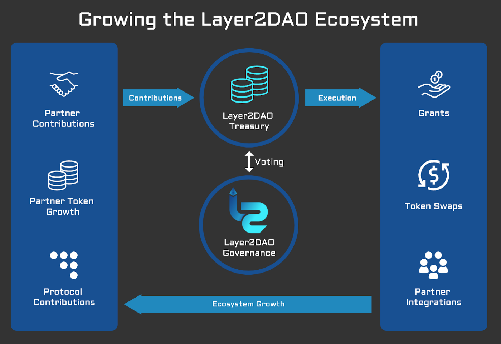

# 🎯 Our Strategy

With a continuously growing DAO Treasury and a future stream of income sources, Layer2DAO will partner with promising or established projects that intend to support the Ethereum Layer2 ecosystem to create synergies. \
\
Layer2DAO benefits from the success of partner projects and the L2 ecosystem as a whole. Success of Layer2DAO partners will increase the contributions to, and value of, the Layer2DAO treasury, allowing more resources to be deployed. This is the flywheel for growth.&#x20;

<figure><figcaption>
Layer2DAO Strategy
</figcaption></figure>

### Layer2DAO Goals

* Become the largest DAO to invest in promising L2 ecosystem projects
* Increase awareness of, promote, and drive TVL to L2 ecosystem projects
* Partner with existing projects through grants, token swaps and other methods
* Attract builders and align incentives
* Boost partners to become category leaders via promotion, liquidity, funding, and operational support
* Focus on fast execution of ideas; encourage experimentation with interim solutions based on policy, trust, and risk management mechanics; iterate towards the long-term solution involving governance and treasury management technologies
* Find ways for L2DAO value to be correlated to the whole L2 ecosystem; treat proposals as synergistic, but also a negotiation of economic terms
* Find ways to avoid micro-decisions from being bottle-necked by the DAO governance process by limiting governance to mandates and funding approvalsl
